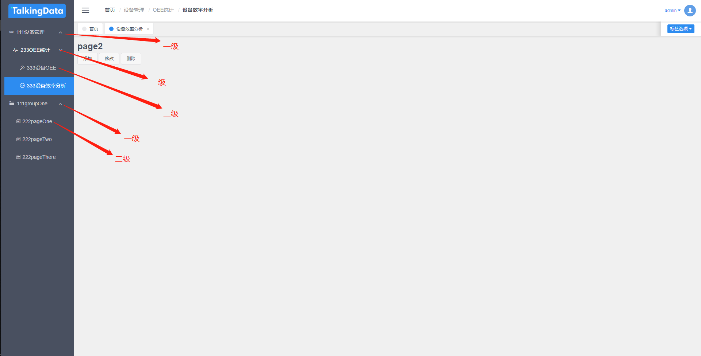

# iview-dynamicRouter
vue+iview组件库的动态路由和权限验证实现
- 在https://gitlab.com/unclepis/iviewadmindynamicrouter 多层路由嵌套的基础上重构
- 左侧菜单中首页也在approuter中返回，出现在左侧菜单中
- 增加了otherrouter返回不再左侧菜单中出现的组件

### 实现目标
客户端从服务端拿到路由和权限数据后，刷新项目的路由和菜单列表，并进行权限控制。
 
### 实现逻辑

#### 动态路由控制加载

一般来说，动态路由控制分为两种：一种是将所有路由数据存储在本地文件中，然后从服务端获取用户的权限信息，在路由跳转时，添加权限判断钩子，如果用户前往的页面不在权限列表内，则禁止跳转。另一种则是本地只存储基本路由，如错误处理页面、无权限控制页面等，而权限路由则从服务器获取，服务器根据用户的权限下发相应的路由数据，客户端利用这些数据进行路由的动态生成和添加，本文采用的是第二种方法。

iview-admin项目将路由分为三种：
1. 不作为Main组件的子页面展示的页面路由，例如login、404、403等错误页面路由；
2. 作为Main组件的子页面展示但是不在左侧菜单显示的路由`otherRouter`，比如首页路由；
3. 作为Main组件的子页面展示并且在左侧菜单显示的路由`appRouter`;


拿到路由数据后，我们主要进行两部分操作，第一部分是遍历数据，利用组件异步加载的方法，加载每个路由节点对应的组件，之后利用`router.addRoutes(routes)`完成路由列表的动态添加；第二部分是因为`iview-admin`框架下的页面标签和面包屑导航，需要遍历appRouter获取路由信息，所以我们也需要将路由数据存入`vuex`，以便全局访问。

**需要特别注意的是**，如果404页面为静态路由，那么第一次进入页面时，这时动态路由还未加载，找不到路由地址会默认跳转到404错误页，体验很差，所以404路由先不写入路由规则中，和动态路由一起加载。

主要代码实现如下：


数据请求及路由节点生成
```
//util.js

// 导入一级和二级的路由组件
import ParentView from '@/views/parentView.vue';
import Main from '@/views/Main.vue';

//生成路由
util.initRouter = function (vm) {
    const constRoutes = [];
    const otherRoutes = [];

    // 404路由需要和动态路由一起注入
    const otherRouter = [{
        path: '/*',
        name: 'error-404',
        meta: {
            title: '404-页面不存在'
        },
        component: 'error-page/404'
    }];
    // 模拟异步请求
    util.ajax('menu.json').then(res => {
        var menuData = res.data;
        util.initRouterNode(constRoutes, menuData);
        util.initRouterNode(otherRoutes, otherRouter);
        // 添加主界面路由
        vm.$store.commit('updateAppRouter', constRoutes.filter(item => item.children.length > 0));
        // 添加全局路由
        vm.$store.commit('updateDefaultRouter', otherRoutes);
        // 刷新界面菜单
        vm.$store.commit('updateMenulist', constRoutes.filter(item => item.children.length > 0));
        
        let tagsList = [];

        vm.$store.state.app.routers.map((item) => {
            if (item.isCustom) { // 一级菜单加了标识
                tagsList.push(item);
            } else if (item.children.length <= 1) {
                tagsList.push(item.children[0]);
            } else {
                tagsList.push(...item.children);
            }
        });
        vm.$store.commit('setTagsList', tagsList);
    });
};

// 重新了util的setCurrentPath方法支持三层路由
```
    util.setCurrentPath = function (vm, name) {
    let title = '';
    let isOtherRouter = false;
    vm.$store.state.app.routers.forEach(item => {
        if (item.name === name && item.isCustom) {
            title = util.handleTitle(vm, item);
            if (item.name === 'otherRouter') {
                isOtherRouter = true;
            }
        } else {
            if (item.children.length === 1) {
                if (item.children[0].name === name) {
                    title = util.handleTitle(vm, item);
                    if (item.name === 'otherRouter') {
                        isOtherRouter = true;
                    }
                }
            } else {
                item.children.forEach(child => {
                    if (child.name === name) {
                        title = util.handleTitle(vm, child);
                        if (item.name === 'otherRouter') {
                            isOtherRouter = true;
                        }
                    }
                });
            }
        }
    });
    let currentPathArr = [];
    //去首页
    if (name === 'home_index') {
        currentPathArr = [
            {
                title: util.handleTitle(vm, util.getRouterObjByName(vm.$store.state.app.routers, 'home_index')),
                path: '',
                name: 'home_index'
            }
        ];
    }
    //去导航菜单一级页面或者OtherRouter路由中的页面
    else if ((name.indexOf('_index') >= 0 || isOtherRouter) && name !== 'home_index') {
        currentPathArr = [
            {
                title: util.handleTitle(vm, util.getRouterObjByName(vm.$store.state.app.routers, 'home_index')),
                path: '/home',
                name: 'home_index'
            },
            {
                title: title,
                path: '',
                name: name
            }
        ];
    }
    //去导航菜单二级页面或三级页面
    else {
        let currentPathObj = vm.$store.state.app.routers.filter(item => {

            var hasMenu;
            if (item.name === name && item.isCustom) {
                hasMenu = true;
                return hasMenu;
            } else if (item.children.length < 1) {
                hasMenu = item.children[0].name === name;
                return hasMenu;
            } else {
                let i = 0;
                let childArr = item.children;
                let len = childArr.length;
                while (i < len) {
                    //如果是三级页面按钮，则在二级按钮数组中找不到这个按钮名称
                    //需要二级页面下可能出现三级子菜单的情况逻辑加入
                    if (childArr[i].name === name) {
                        hasMenu = true;
                        return hasMenu;
                    }
                    i++;
                }
                //如果一级，二级菜单下都没有此按钮名称，则遍历三级菜单
                if (!hasMenu) {
                    for (let m = 0; m < childArr.length; m++) {
                        if (!childArr[m].children) continue;
                        let sonArr = childArr[m].children;
                        for (let n = 0; n < sonArr.length; n++) {
                            if (sonArr[n].name === name) {
                                hasMenu = true;
                                return hasMenu;
                            }
                        }
                    }
                }
                return false;
            }
        })[0];
        if (currentPathObj && currentPathObj.isCustom) {
            currentPathArr = [
                {
                    title: '首页',
                    path: '',
                    name: 'home_index'
                },
                {
                    title: currentPathObj.title,
                    path: currentPathObj.path,
                    name: currentPathObj.name
                },
            ];
        }
        else if (currentPathObj.children.length <= 1 && currentPathObj.name === 'home') {
            currentPathArr = [
                {
                    title: '首页',
                    path: '',
                    name: 'home_index'
                }
            ];
        }
        else {
            //如果是三级页面按钮，则在二级按钮数组中找不到这个按钮名称
            //需要二级页面下可能出现三级子菜单的情况逻辑加入
            let childObj = currentPathObj.children.filter((child) => {
                return child.name === name;
            })[0];

            // let thirdLevelObj =
            console.log(childObj)
            //二级页面
            if (childObj) {
                currentPathArr = [
                    {
                        title: '首页',
                        path: '/home',
                        name: 'home_index'
                    },
                    {
                        title: currentPathObj.title,
                        path: '',
                        name: currentPathObj.name
                    },
                    {
                        title: childObj.title,
                        path: currentPathObj.path + '/' + childObj.path,
                        name: name
                    }
                ];
            }
            //childobj为undefined，再从三级页面中遍历
            else {
                let thirdObj;
                let childObj = currentPathObj.children.filter((child) => {
                    let hasChildren;
                    hasChildren = child.name === name;
                    if (hasChildren) return hasChildren

                    if (child.children) {
                        let sonArr = child.children;
                        for (let n = 0; n < sonArr.length; n++) {
                            if (sonArr[n].name === name) {
                                thirdObj = sonArr[n];
                                hasChildren = true;
                                return hasChildren;
                            }
                        }
                    }
                    return hasChildren
                })[0];

                if (thirdObj && childObj) {
                    currentPathArr = [
                        {
                            title: '首页',
                            path: '/home',
                            name: 'home_index'
                        },
                        {
                            title: currentPathObj.title,
                            path: '',
                            name: currentPathObj.name
                        },
                        {
                            title: childObj.title,
                            path: '',    //设为空是因为此二级菜单没有实际页面且用于面包屑组件显示，path为空的将不可单击
                            name: childObj.name
                        },
                        {
                            title: thirdObj.title,
                            path: currentPathObj.path + '/' + childObj.path + '/' + thirdObj.path,
                            name: thirdObj.name
                        }
                    ];
                }

            }

        }
    }

    vm.$store.commit('setCurrentPath', currentPathArr);
    return currentPathArr;
};
```

```
动态加载组件
```
//lazyLoading.js

export default (url) =>()=>import(`@/views/${url}.vue`)
```

最后在main.js中进行调用
```
//main.js
 mounted () {
    // 调用方法，动态生成路由
    util.initRouter(this);
  }
```

// mock 后台返回的三级菜单
```
//test.json，模拟异步请求数据
{
    "menuList": [ // appRouter在左侧菜单栏中显示的组件
        { // 首页也从后台返回，可以根据用户角色返回不同的首页
            "path": "/",
            "name": "home_index",
            "icon": "ios-pulse",
            "title": "首页",
            "component": "Main",
            "isCustom": true,
            "children": [
                {
                    "path": "home",
                    "name": "home_index",
                    "icon": "ios-pulse",
                    "title": "首页",
                    "component": "home/home"
                }
            ]
        },
        { // 改造后的路由最多支持三级嵌套
            "path": "/deviceManagement",
            "name": "deviceManagement",
            "icon": "link",
            "title": "设备管理",
            "component": "Main",
            "children": [
                {
                    "path": "/OeeStatistics",
                    "name": "OeeStatistics",
                    "icon": "ios-pulse",
                    "title": "OEE统计",
                    "component": "ParentView",
                    "children": [
                        {
                            "path": "deviceOEE",
                            "name": "deviceOEE",
                            "icon": "wand",
                            "title": "设备OEE",
                            "component": "deviceManagement/OeeStatistics/deviceOEE/deviceOEE"
                        },
                        {
                            "path": "deviceEfficiencyAnalysis",
                            "name": "deviceEfficiencyAnalysis",
                            "icon": "ios-analytics-outline",
                            "title": "设备效率分析",
                            "component": "deviceManagement/OeeStatistics/deviceEfficiencyAnalysis/deviceEfficiencyAnalysis"
                        },
                        {
                            "path": "deviceAlarmStatistics",
                            "name": "deviceAlarmStatistics",
                            "icon": "ios-analytics-outline",
                            "title": "设备告警统计",
                            "component": "deviceManagement/OeeStatistics/deviceAlarmStatistics/deviceAlarmStatistics"
                        },
                        {
                            "path": "deviceLogAnalysis",
                            "name": "deviceLogAnalysis",
                            "icon": "ios-analytics-outline",
                            "title": "设备日志分析",
                            "component": "deviceManagement/OeeStatistics/deviceLogAnalysis/deviceLogAnalysis"
                        },
                        {
                            "path": "deviceStopAnalysis",
                            "name": "deviceStopAnalysis",
                            "icon": "ios-analytics-outline",
                            "title": "设备停机分析",
                            "component": "deviceManagement/OeeStatistics/deviceStopAnalysis/deviceStopAnalysis"
                        }
                    ]
                },
                {
                    "path": "/deviceArchives",
                    "name": "deviceArchives",
                    "icon": "ios-pulse",
                    "title": "设备档案",
                    "component": "ParentView",
                    "children": [
                        {
                            "path": "archivesBasicInfo",
                            "name": "archivesBasicInfo",
                            "icon": "wand",
                            "title": "详情基本信息",
                            "component": "deviceManagement/deviceArchives/archivesBasicInfo/archivesBasicInfo"
                        },
                        {
                            "path": "archivesDataCollection",
                            "name": "archivesDataCollection",
                            "icon": "ios-analytics-outline",
                            "title": "详情数据采集",
                            "component": "deviceManagement/deviceArchives/archivesDataCollection/archivesDataCollection"
                        },
                        {
                            "path": "archivesDeviceAlarm",
                            "name": "archivesDeviceAlarm",
                            "icon": "ios-analytics-outline",
                            "title": "详情设备告警",
                            "component": "deviceManagement/deviceArchives/archivesDeviceAlarm/archivesDeviceAlarm"
                        },
                        {
                            "path": "archivesDeviceLog",
                            "name": "archivesDeviceLog",
                            "icon": "ios-analytics-outline",
                            "title": "详情设备日志",
                            "component": "deviceManagement/deviceArchives/archivesDeviceLog/archivesDeviceLog"
                        },
                        {
                            "path": "archivesCollectionPointConfig",
                            "name": "archivesCollectionPointConfig",
                            "icon": "ios-analytics-outline",
                            "title": "详情采集点配置",
                            "component": "deviceManagement/deviceArchives/archivesCollectionPointConfig/archivesCollectionPointConfig"
                        }
                    ]
                },
                {
                    "path": "/alarmManagement",
                    "name": "alarmManagement",
                    "icon": "ios-pulse",
                    "title": "告警管理",
                    "component": "ParentView",
                    "children": [
                        {
                            "path": "alarmConfirmOrNot",
                            "name": "alarmConfirmOrNot",
                            "icon": "wand",
                            "title": "告警确认/待确认",
                            "component": "deviceManagement/alarmManagement/alarmConfirmOrNot/alarmConfirmOrNot"
                        },
                        {
                            "path": "alarmHistoryQuery",
                            "name": "alarmHistoryQuery",
                            "icon": "ios-analytics-outline",
                            "title": "告警历史查询",
                            "component": "deviceManagement/alarmManagement/alarmHistoryQuery/alarmHistoryQuery"
                        },
                        {
                            "path": "alarmKnowledge",
                            "name": "alarmKnowledge",
                            "icon": "ios-analytics-outline",
                            "title": "告警知识库",
                            "component": "deviceManagement/alarmManagement/alarmKnowledge/alarmKnowledge"
                        }
                    ]
                }
            ]
        },
        {
            "path": "/systemManagement",
            "name": "systemManagement",
            "icon": "link",
            "title": "系统管理",
            "component": "Main",
            "children": [
                {
                    "path": "/alarmConfiguration",
                    "name": "alarmConfiguration",
                    "icon": "ios-pulse",
                    "title": "告警配置",
                    "component": "ParentView",
                    "children": [
                        {
                            "path": "alarmRedefine",
                            "name": "alarmRedefine",
                            "icon": "wand",
                            "title": "告警重定义",
                            "component": "systemManagement/alarmConfiguration/alarmRedefine/alarmRedefine"
                        },
                        {
                            "path": "alarmLevelConfiguration",
                            "name": "alarmLevelConfiguration",
                            "icon": "ios-analytics-outline",
                            "title": "告警等级配置",
                            "component": "systemManagement/alarmConfiguration/alarmLevelConfiguration/alarmLevelConfiguration"
                        },
                        {
                            "path": "alarmTypeConfiguration",
                            "name": "alarmTypeConfiguration",
                            "icon": "ios-analytics-outline",
                            "title": "告警类型配置",
                            "component": "systemManagement/alarmConfiguration/alarmTypeConfiguration/alarmTypeConfiguration"
                        }
                    ]
                },
                {
                    "path": "/systemConfiguration",
                    "name": "systemConfiguration",
                    "icon": "ios-pulse",
                    "title": "系统配置",
                    "component": "ParentView",
                    "children": [
                        {
                            "path": "roleManagement",
                            "name": "roleManagement",
                            "icon": "wand",
                            "title": "角色管理",
                            "component": "systemManagement/systemConfiguration/roleManagement/roleManagement"
                        },
                        {
                            "path": "userManagement",
                            "name": "userManagement",
                            "icon": "ios-analytics-outline",
                            "title": "用户管理",
                            "component": "systemManagement/systemConfiguration/userManagement/userManagement"
                        },
                        {
                            "path": "systemMaintanance",
                            "name": "systemMaintanance",
                            "icon": "ios-analytics-outline",
                            "title": "系统维护",
                            "component": "systemManagement/systemConfiguration/systemMaintanance/systemMaintanance"
                        }
                    ]
                },
                {
                    "path": "/menuConfiguration",
                    "name": "menuConfiguration",
                    "icon": "ios-pulse",
                    "title": "菜单配置",
                    "component": "systemManagement/menuConfiguration/menuConfiguration"
                },
                {
                    "path": "/operationLog",
                    "name": "operationLog",
                    "icon": "ios-pulse",
                    "title": "操作日志",
                    "component": "systemManagement/operationLog/operationLog"
                },
                {
                    "path": "/theirMonitoring",
                    "name": "theirMonitoring",
                    "icon": "ios-pulse",
                    "title": "自身监控",
                    "component": "systemManagement/theirMonitoring/theirMonitoring"
                }
            ]
        },
        {
            "path": "/factoryMonitor",
            "name": "factoryMonitor",
            "icon": "ios-pulse",
            "title": "车间监控",
            "component": "Main",
            "isCustom": true,
            "children": [
                {
                    "path": "/factoryMonitor",
                    "name": "factoryMonitor",
                    "icon": "ios-pulse",
                    "title": "车间监控001",
                    "component": "systemManagement/iframeView/factoryViewer"
                }
            ]
        }
    ],
    "otherRouter": [ // otherRouter在左侧菜单栏中不显示的组件
        {
            "path": "/deviceManagement",
            "title": "设备管理",
            "name": "deviceManagement",
            "component": "Main",
            "children": [
                {
                    "path": "deviceDetailsInfo",
                    "title": "设备详细",
                    "name": "deviceDetails",
                    "component": "test"
                }
            ]
        }
    ]
}
```

//修改main-components/components/siderbarMenu.vue文件,渲染三级菜单
```
<template>
    <Menu ref="sideMenu" :active-name="$route.name" :open-names="openNames" :theme="menuTheme" width="auto" @on-select="changeMenu">
        <template v-for="levelOne in menuList">
                    <template v-if="levelOne.isCustom">  <!-- 一级菜单 -->
                         <MenuItem  :name="levelOne.name" :key="levelOne.name">
                            <Icon :type="levelOne.icon" :size="iconSize" :key="levelOne.name_icon"></Icon>
                            <span class="layout-text" :key="levelOne.title">{{ levelOne.title }}</span>
                        </MenuItem>
                    </template>
                     <template v-else> <!-- 多级菜单级菜单 -->
                        <Submenu v-if="levelOne.children.length >=1" :name="levelOne.name" :key="levelOne.path">
                        <template slot="title">
                            <Icon :type="levelOne.icon" :size="iconSize"></Icon>
                            <span class="layout-text">{{ itemTitle(levelOne) }}</span>
                        </template>
                        <template v-for="levelTwo in levelOne.children">
                            <MenuItem class="levelOneSubmenu" v-if="isThirdLeveMenu(levelTwo)==false" :name="levelTwo.name" :key="levelTwo.name">
                                <Icon :type="levelTwo.icon" :size="iconSize" :key="levelTwo.name_icon"></Icon>
                                <span class="layout-text" :key="levelTwo.name_span">{{ levelTwo.title }}</span>
                            </MenuItem>
                            <Submenu class="levelTwoSubmenu" v-if="isThirdLeveMenu(levelTwo)==true" :name="levelTwo.name" :key="'menuitem' + levelTwo.name">
                                    <template slot="title">
                                        <Icon :type="levelTwo.icon" :size="iconSize" :key="'icon' + levelTwo.name"></Icon>
                                        <span class="layout-text" :key="'title' + levelTwo.name">{{ itemTitle(levelTwo) }}</span>
                                    </template>
                                    <template v-for="levelThree in levelTwo.children">
                                        <MenuItem :name="levelThree.name" :key="'menuitem' + levelThree.name">
                                        <Icon :type="levelThree.icon" :size="iconSize" :key="'icon' + levelThree.name"></Icon>
                                        <span class="layout-text" :key="'title' + levelThree.name">{{ itemTitle(levelThree) }}</span>
                                        </MenuItem>
                                    </template>
                                </Submenu>
                            </template>
                        </Submenu>
                     </template>
        </template>
    </Menu>
</template>
```

// iview menu组件引入submenu后样式有点问题,自己写了样式修复样式的问题
```
// 修复菜单背景颜色因为margin错位的问题
.ivu-menu-dark.ivu-menu-vertical .ivu-menu-opened{
    background: #495060;
}
// 修复二级和三级菜单样式错位的问题
.levelTwoSubmenu{
    margin-left: 10px;
}

// 修复点击二级菜单 submenu 箭头不变化的问题
.levelTwoSubmenu.ivu-menu-submenu.ivu-menu-opened .ivu-icon.ivu-icon-ios-arrow-down.ivu-menu-submenu-title-icon{
    -webkit-transform: rotate(0);
    transform: rotate(0);
}

.levelTwoSubmenu .ivu-menu-item{
    background: #495060;
}
// 未选中元素hover颜色的bug
.ivu-menu-dark.ivu-menu-vertical .ivu-menu-submenu .ivu-menu-item:hover{
    color: #fff;
    background: #495060 !important;
}
// 已经选中元素hover颜色bug
.levelTwoSubmenu .ivu-menu-item.ivu-menu-item-active.ivu-menu-item-selected:hover{
    border-right: none;
    color: #fff;
    background: #2d8cf0!important;
}
```
